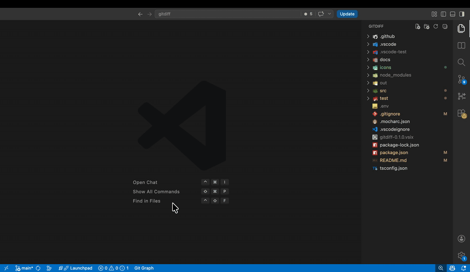

<p align="center">
  <table align="center"><tr><td bgcolor="#ffffff" align="center" style="background-color:#ffffff;padding:12px;border-radius:12px;">
    
  </td></tr></table>
</p>

<h1 align="center">GitDiff</h1>

<p align="center">
  <strong>Diff your working tree against any branch or commit — and keep editing.</strong>
</p>

<p align="center">
  <a href="https://marketplace.visualstudio.com/items?itemName=tigercosmos.gitdiff"></a>
  
  
  
</p>

<p align="center">
  
</p>

---

## Why GitDiff?

VS Code's built-in Git diff compares against **HEAD** or the **index**. It does not let you ask:

> *"How does this file in my working tree look compared to `origin/main`? Or to that commit from last Tuesday?"*

GitDiff does exactly that — and unlike a read-only `git diff`, **the working-tree side stays live and editable**. You can read the comparison and fix the code in the same view, then hit save.

## Features

- **Compare against any branch** — local or remote-tracking, with a quick-pick search.
- **Compare against any commit** — recent commits in a picker, plus a free-form "Enter SHA…" option.
- **Editable right pane** — it's the real file on disk. Edit and save like any normal editor.
- **Read-only left pane** — backed by `git show <ref>:<path>`, so you can't accidentally clobber history.
- **Current-line blame** — the line your cursor is on shows a dim end-of-line annotation (author, date, commit subject) in any file in a git repo and in GitDiff's diff panes. Toggle with `gitdiff.lineBlame.enabled`.
- **Blame on hover** — hover a line to see the last commit that touched it (author, date, commit subject, short SHA), plus a link to **open that commit's diff for the file** in the editor and, when a remote is configured, links to **view the commit on the web** and its **pull/merge request** (resolved from the commit subject — no token or API call). The working-tree side blames your live contents, so it stays accurate as you edit; uncommitted lines show a clean "Not committed yet".
- **Changed-Files sidebar** — pick a target once, see every file in your tree that differs from it, click to open the diff.
- **Search + path filters in the sidebar** — narrow the changed-files list with a content search (match case / whole word / regex toggles, mirroring VS Code Search) plus comma-separated `files to include` / `files to exclude` glob inputs.
- **Live branch tracking** — when comparing against a branch, "Refresh" re-resolves it to the current tip.
- **Repo-aware** — works correctly with multi-root workspaces, nested repos, and reserved characters in branch names.
- **Safe by default** — refuses to diff binary or non-UTF-8 blobs, declares no virtual-workspace support, and the `git` binary path is machine-scoped (workspace settings can't override it).

## Install

**From the Marketplace**

```
ext install tigercosmos.gitdiff
```

**From a `.vsix`**

```bash
code --install-extension gitdiff-0.5.0.vsix
```

## Usage

### Compare a single file

1. Open any file from your workspace.
2. Run one of:
   - `GitDiff: Compare with Branch…`
   - `GitDiff: Compare with Commit…`
3. Pick a target. The diff opens with **the target on the left** (read-only) and **your working-tree file on the right** (editable).

You can also right-click a file in the Explorer or on the editor tab to launch either command.

Hover over any line in the diff to see the last commit that touched it — author, date, commit subject, and short SHA.

### Browse every changed file

1. Click the **GitDiff** icon in the Activity Bar.
2. Hit **Set Comparison Target…** in the view's title.
3. Click any file in the list to open its diff against your chosen target.
4. Narrow the list with the **Search** box (toggle match-case / whole-word / regex on the right) and the **files to include** / **files to exclude** glob inputs — same comma-separated syntax as VS Code's Search panel (`*.ts`, `src/`, `**/*.test.ts`, `*.{ts,tsx}`). Filter state is remembered per workspace.
5. Use the **Clear Comparison Target** button (`$(clear-all)`) in the view's title to drop the target and close every open GitDiff diff in one click.

### Editor title actions

When a GitDiff diff is the active editor:

| Action | Command |
|---|---|
| Refresh the diff (re-resolves branch tips) | `gitdiff.refresh` |
| Pick a different target | `gitdiff.changeTarget` |

## Commands

| Command | ID |
|---|---|
| Compare with Branch… | `gitdiff.compareWithBranch` |
| Compare with Commit… | `gitdiff.compareWithCommit` |
| Refresh Diff | `gitdiff.refresh` |
| Change Target… | `gitdiff.changeTarget` |
| Set Comparison Target… (sidebar) | `gitdiff.changedFiles.setTarget` |
| Refresh Changed Files (sidebar) | `gitdiff.changedFiles.refresh` |
| Clear Comparison Target (sidebar) | `gitdiff.changedFiles.clearTarget` |

## Configuration

| Setting | Type | Default | Description |
|---|---|---|---|
| `gitdiff.commitPickerLimit` | number | `100` | Maximum number of recent commits shown in the commit picker (1–5000). |
| `gitdiff.gitPath` | string | `""` | Absolute path to the `git` executable. Empty resolves from `PATH`. **Machine-scoped** — workspace settings cannot override it. |

## Requirements

- VS Code **1.85** or newer.
- A local `git` binary on `PATH` (or set `gitdiff.gitPath`).
- A real `file:` workspace. Virtual workspaces (`vscode.dev`, browser-based Codespaces, Remote – Repositories) are not supported.

## How it works

```
┌──────────────────────────────────────────────────────────────┐
│  extension.ts        — activation, command + provider wiring │
├──────────────────────────────────────────────────────────────┤
│  GitService          — shells out to `git` via execFile      │
│  RefPicker           — QuickPick UI for branches and commits │
│  DiffOpener          — builds URIs and calls vscode.diff     │
│  GitShowProvider     — TextDocumentContentProvider (left)    │
│  BlameHoverProvider  — per-line blame hover on both panes    │
│  ChangedFilesProvider — WebviewView for the sidebar          │
│  ActiveDiffTracker   — maintains the activeDiff context key  │
└──────────────────────────────────────────────────────────────┘
```

The left pane is a virtual document with the `gitdiff:` scheme:

```
gitdiff:/<repo-relative-path>?ref=<full-sha>&repo=<absolute-repo-root>[&branch=<branch>]
```

The ref is pinned to a verified 40-char SHA at open time (so the left pane is reproducible), the repo root is encoded explicitly (so multi-root and nested-repo workspaces resolve correctly), and the file path stays in the URI's path (so language detection just works). When you compare against a branch, the original branch name is preserved in `branch=` so **Refresh** can re-resolve it to the current tip; diffs opened against a specific commit omit `branch=` and stay pinned. All three values round-trip through `URLSearchParams`, so `/`, `?`, `#`, `&`, `%`, spaces, and non-ASCII characters survive intact. The right pane is the unmodified `file:` URI for the workspace file — that's why edit and save behave normally.

## Development

```bash
npm install
npm run compile      # tsc
npm run watch        # incremental build
npm test             # integration tests (VS Code test host)
npm run test:unit    # unit tests (mocha + ts-node)
npm run package      # build a .vsix
```

Press **F5** in VS Code to launch an Extension Development Host with the extension loaded.

## License

MIT
